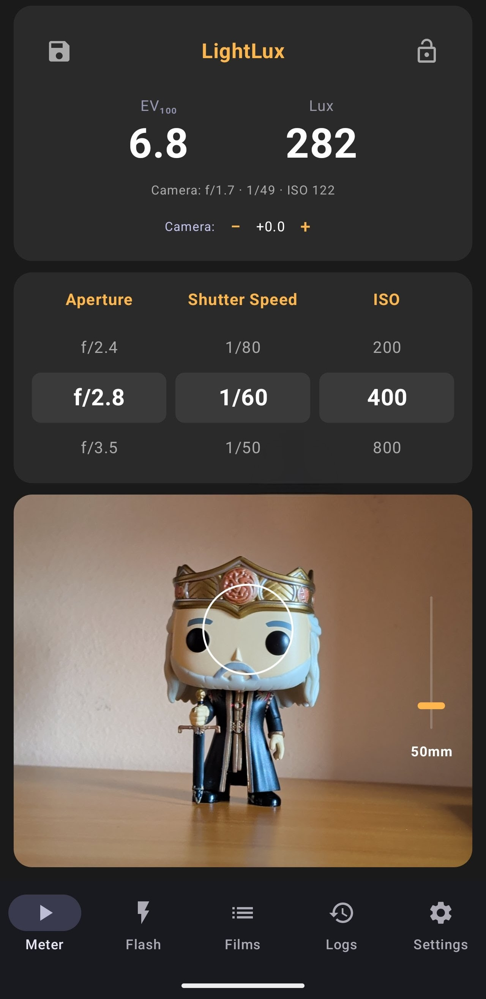
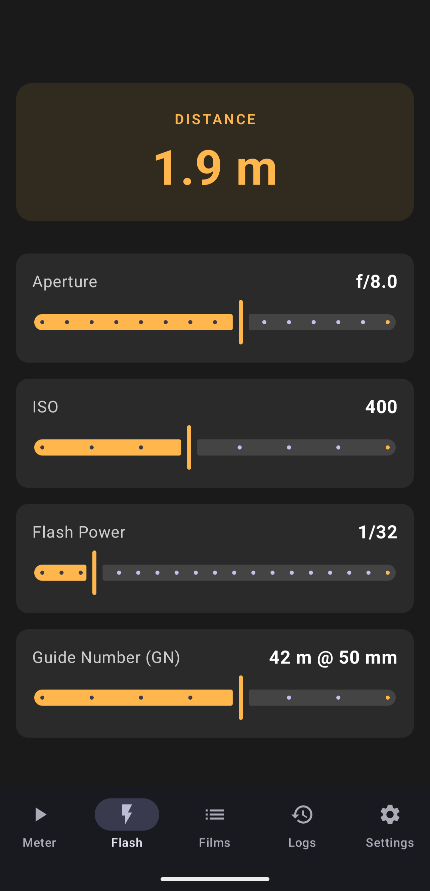
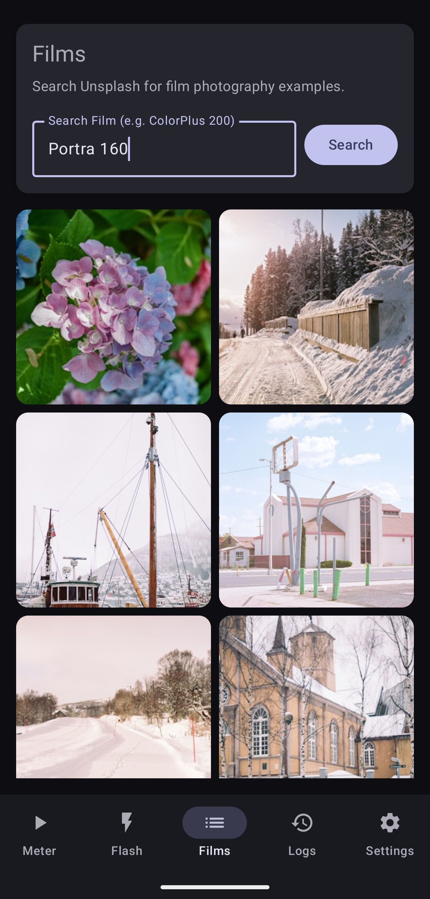

# LightLux

**LightLux** is an Android application designed for film photographers. It transforms your smartphone into a high-precision light meter with advanced exposure calculations and secure data persistence.

### Screenshots

  
  
   

## ✨ Key Features

### 🔹 1. Real-Time Light Metering

- **Scientific Measurement**: Measures intensity in **LUX** and computes exposure in **EV (Exposure Value)**.
- **Dynamic Stability**: Implements 0.5s continuous background buffering for smooth, reliable readings without jitter.
- **Tap-to-Meter**: Intuitive focus and metering by tapping anywhere on the camera preview.
- **Lock System**: Lock your readings to securely calculate settings without sensor interference.

### 🔹 2. Advanced Exposure Calculator

- **Film Parameters**: Quick selection of ISO (50-6400), Aperture (f/1.8-f/22), and Shutter Speed.
- **Focal Length Simulation**: A custom, non-linear zoom bar (26mm to 390mm) with **gradual control** (75% of the slider for the common 26-150mm range).
- **Step-Adjustable Speed**: Choose between 1, 1/2, or 1/3 exposure steps in settings.

### 🔹 3. Encrypted History (Jurnal)

- **SQLCipher Integration**: Your photography logs are stored in a **256-bit AES encrypted** Room database.
- **Metadata Persistence**: Saves EV, Lux, f-stop, Shutter Speed, ISO, and a timestamp for every reading.
- **Secure Notes**: Add optional captions with built-in **input sanitization** to prevent data injection.

### 🔹 4. Specialized Tools

- **Flash Guide Number Calculator**: Quickly determine the required aperture or distance for your external flash.
- **Film Gallery Integration**: Browse stunning film photography inspiration, powered by the **Unsplash API** using Retrofit and HTTPS.

## 🛠️ Technology Stack & Architecture

- **Language**: Kotlin with Coroutines and Flow.
- **UI Framework**: Jetpack Compose (Modern, Declarative, Premium looks).
- **Architecture**: MVVM (Model-View-ViewModel) for clean separation of concerns.
- **Imaging**: CameraX with Camera2 Interop for pro-level metadata.
- **Database**: Room with SQLCipher for advanced security.
- **Networking**: Retrofit & OkHttp for secure API communication.
- **Design**: Modern "Dark Mode" aesthetic with Amber accents and premium card-based layouts.

## 🔒 Security & Privacy

- **Data Encryption**: All local data is encrypted at rest using SQLCipher.
- **Privacy-First**: No location permissions or tracking data are requested or stored.
- **Secure Communication**: All external API requests are forced through HTTPS.

## 🚀 Getting Started

1.  Clone the repository.
2.  Open in Android Studio.
3.  Build and Run on a physical device for the best camera experience.
