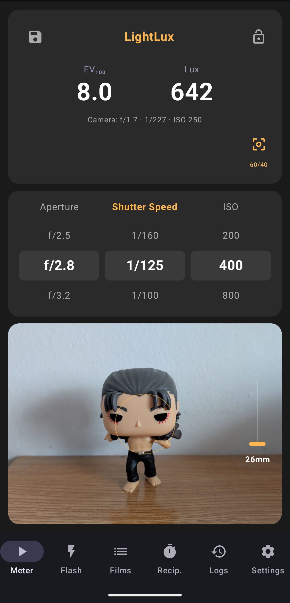
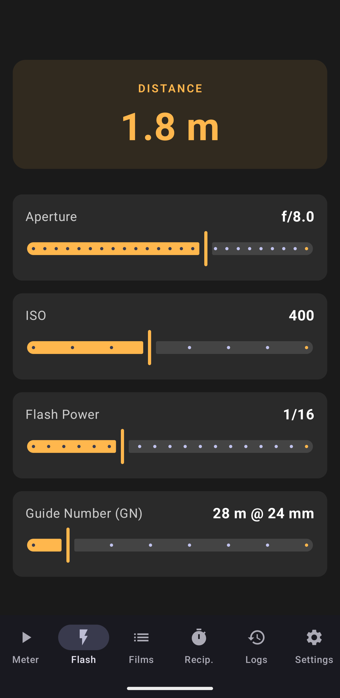
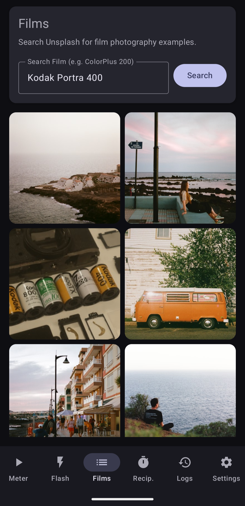
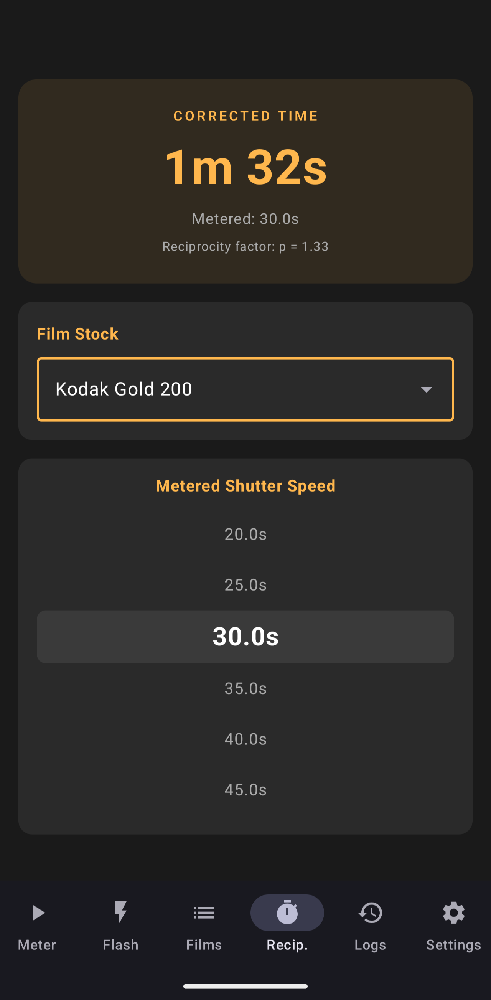

# LightLux

## TADAM Project - Mireanu Cosmin - TEAM

**LightLux** is an Android application designed for film photographers. It transforms your smartphone into a high-precision light meter with advanced exposure calculations and secure data persistence.

---

### Screenshots

  
  
   
  

## Key Features

### 1. Real-Time Light Metering
- **Accurate Measurement**: Measures intensity in **LUX** and computes exposure in **EV (Exposure Value)**.
- **Dynamic Stability**: Implements 0.5s continuous background buffering for smooth, reliable readings without jitter.
- **Tap-to-Meter**: Focus and spot meter by tapping anywhere on the live camera preview.
- **Metering Modes**: Switch between precision Spot Metering (5% area) and classic 60/40 Center-Weighted metering.
- **Lock System**: Lock your readings to securely calculate settings without sensor interference.

### 2. Advanced Exposure Calculator

- **Film Parameters**: Quick selection of ISO (50-6400), Aperture (f/1.8-f/22), and Shutter Speed.
- **Priority Modes**: Set your desired aperture or shutter speed, and the app seamlessly calculates the corresponding value.
- **Focal Length Simulation**: A custom, non-linear zoom bar (26mm to 390mm) with **gradual control** (75% of the slider for the common 26-150mm range).
- **Step-Adjustable Speed**: Choose between 1, 1/2, or 1/3 exposure steps in settings.

### 3. Encrypted History (Journal)

- **SQLCipher Integration**: Your photography logs are stored in a **256-bit AES encrypted** Room database.
- **Metadata Persistence**: Saves EV, Lux, f-stop, Shutter Speed, ISO, and a timestamp for every reading.
- **Secure Notes**: Add optional captions with built-in **input sanitization** to prevent data injection.

### 4. Specialized Tools
- **Reciprocity Failure Calculator**: Computes long exposure adjustments for an database of 30+ popular film stocks (Kodak, Ilford, Fujifilm, CineStill, Fomapan, etc.).
- **Flash Guide Number Calculator**: Instantly determine the required aperture or distance for your external flash.
- **Film Gallery Integration**: Browse stunning photography inspiration powered by the **Unsplash API** using Retrofit and HTTPS.

---

## Mathematical Foundations

The core calculation logic in `LuminosityAnalyzer` is backed by standard photographic physics formulas:

### 1. Camera Exposure Value ($EV_{cam}$)
The Exposure Value represents the combination of aperture ($N$) and shutter speed ($t$):
$$EV_{cam} = \log_2\left(\frac{N_{cam}^2}{t_{cam}}\right)$$

### 2. Standardized Exposure Value at ISO 100 ($EV_{100}$)
Normalizes the camera's current exposure sensor parameters to a standard ISO 100 reference:
$$EV_{100} = EV_{cam} - \log_2\left(\frac{S_{cam}}{100}\right)$$
*Where $S_{cam}$ is the active camera sensitivity (ISO).*

### 3. Film Parameter Solutions
Once $EV_{100}$ is determined, the exposure calculator solves for the target film parameters based on priority modes:
*   **Shutter Speed ($t_{film}$)**:
    $$t_{film} = \frac{N_{film}^2}{2^{EV_{100}} \cdot \left(\frac{S_{film}}{100}\right)}$$
*   **Aperture ($N_{film}$)**:
    $$N_{film} = \sqrt{t_{film} \cdot 2^{EV_{100}} \cdot \left(\frac{S_{film}}{100}\right)}$$
*   **ISO Sensitivity ($S_{film}$)**:
    $$S_{film} = 100 \cdot \frac{N_{film}^2}{t_{film} \cdot 2^{EV_{100}}}$$

### 4. Illuminosity (Lux) Approximation
Approximates raw lux values directly from $EV_{100}$ for ambient brightness measurement:
$$E_v = 2.5 \cdot 2^{EV_{100}}\ \text{lux}$$

### 5. Reciprocity Failure Correction
For long exposures (generally $t > 1.0\text{s}$), emulsion films suffer from reciprocity failure (the Schwarzschild effect). The app corrects this using film-specific Schwarzschild exponents ($p$):
$$t_{corrected} = t_{metered}^p$$
*Where $p$ represents the reciprocity constant of the selected film stock (e.g., $1.30$ for Portra 400, $1.54$ for Fomapan 100).*

### 6. Flash Guide Number Distance ($D$)
Determines the required distance $D$ for direct flash based on the flash Guide Number ($GN$), ISO sensitivity ($S$), Aperture ($N$), and flash power fraction ($P_{frac}$):
$$GN_{effective} = GN_{base} \cdot \sqrt{\frac{S}{100}} \cdot \sqrt{P_{frac}}$$
$$D = \frac{GN_{effective}}{N}$$

---

## Technology Stack & Architecture

- **Language**: Kotlin with Coroutines and Flow.
- **UI Framework**: Jetpack Compose (Modern, Declarative, Premium looks).
- **Architecture**: MVVM (Model-View-ViewModel) for clean separation of concerns.
- **Imaging**: CameraX with Camera2 Interop for pro-level metadata.
- **Database**: Room with SQLCipher for advanced security.
- **Networking**: Retrofit & OkHttp for secure API communication.
- **Design**: Modern "Dark Mode" aesthetic with Amber accents and premium card-based layouts.

## Security & Privacy

- **Data Encryption**: All local data is encrypted at rest using SQLCipher.
- **Privacy-First**: No location permissions or tracking data are requested or stored.
- **Secure Communication**: All external API requests are forced through HTTPS.

## Getting Started

1.  Clone the repository.
2.  Open in Android Studio.
3.  Build and Run on a physical device for the best camera experience.
